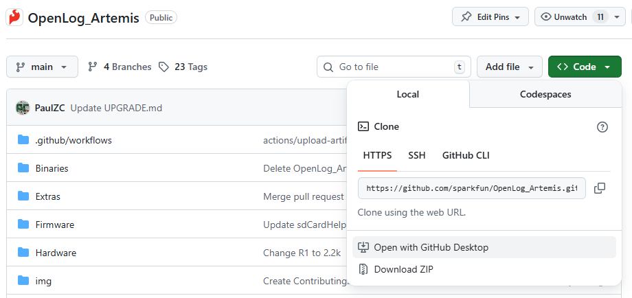
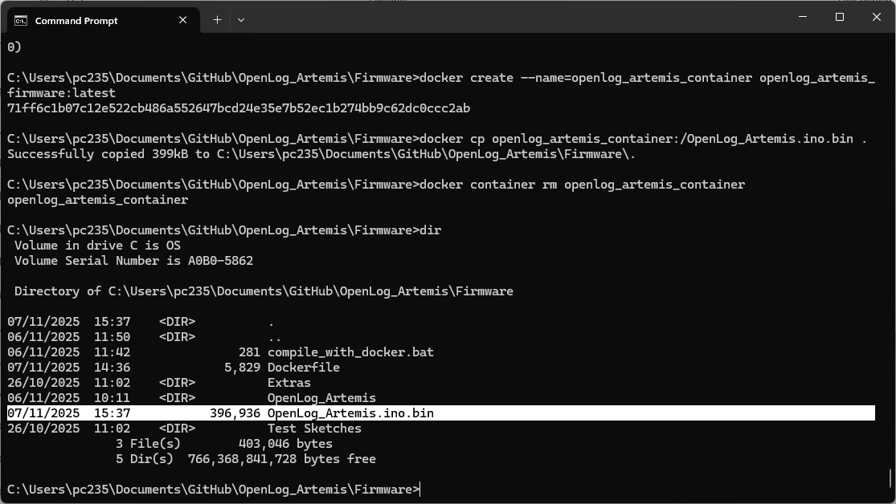

# OpenLog Artemis : How To Compile The OLA Firmware Binary

* [Using Docker](#using-docker)
* [How SparkFun does it](#how-sparkfun-does-it)
* [Using Arduino IDE (Deprecated)](#using-arduino-ide-deprecated)

## Using Docker

Installing the correct version of the Apollo3 core and of each required Arduino library, is tedious and error-prone. Especially on Windows. We've lost count of the number of times code compilation fails on our local machines, because we had the wrong core or library installed, or forgot to patch the core correctly... It is much easier to sandbox the firmware compilation using an environment like [Docker](https://www.docker.com/).

Docker is open-source. It is our new favourite thing!

Here is a step-by-step guide for how to install Docker and compile the firmware from scratch:

### Clone, fork or download the OpenLog_Artemis repo

To build the OpenLog_Artemis firmware, you obviously need a copy of the source code.

If you are familiar with Git and GitHub Desktop, you can clone the OpenLog_Artemis repo directly into GitHub Desktop:



If you want to _contribute_ to OpenLog_Artemis, and already have a GitHub account, you can Fork the repo:


Clone your fork to your local machine, make changes, and send us a Pull Request. This is exactly what the SparkFun Team do when developing the code. Please use the `release_candidate` branch for any such changes. We are very unlikely to merge anything directly into `main`, unless it is (e.g.) docs corrections or improvements.

If you don't want to do either of those, you can simply Download a Zip copy of the repo instead. You will receive a complete copy as a Zip file. You can do this from the green **Code** button, or click on the icon below to download a copy of the main (released) branch:

[](https://github.com/sparkfun/OpenLog_Artemis/archive/refs/heads/main.zip "Download ZIP (main branch)")

For the real Wild West experience, you can also download a copy of the `release_candidate` code branch. This is where the team is actively changing and testing the code, before it becomes a full release. The code there will _usually_ compile and will _usually_ work, but we don't guarantee it! We may be part way through implementing some breaking changes at the time of your download...

[](https://github.com/sparkfun/OpenLog_Artemis/archive/refs/heads/release_candidate.zip "Download ZIP (release_candidate branch)")

### Install Docker Desktop

* **(Optional)** Head to [Docker](https://www.docker.com/) and create an account. A free "Personal" account will cover occasional compilations of the firmware
* Download and install [Docker Desktop](https://docs.docker.com/get-started/get-docker/) - there are versions for Mac, Windows and Linux. You may need to restart to complete the installation.
* Run the Desktop
    * You don't _need_ to have an account and you don't _need_ to be signed in
    * You only need to be signed in if you want to store or share your Container on Docker Hub
    * If you don't sign in, Docker Desktop will run in Personal mode - which will cover local compilations of the firmware
* On Windows, you may see an error saying "**WSL needs updating** Your version of Windows Subsystem for Linux (WSL) is too old". If you do:
    * Open a command prompt
	* Type `wsl --update` to update WSL. At the time of writing, this installs Windows Subsystem for Linux 2.6.1
	* Restart the Docker Desktop
* If you are using Docker for the first time, the "What is a container?" and "How do I run a container?" demos are useful - _but not essential_
    * On Windows, you may want to give Docker Desktop permission to access to your Network, so it can access (e.g.) HTML ports
	* You can Stop the container and Delete it when you are done
* You may want to prevent Docker from running when your machine starts up
    * Uncheck "Start Docker Desktop when you sign in to your computer" in the Desktop settings

### Using Docker to create the firmware binary

* **Make sure you have Docker Desktop running.** You don't need to be signed in, but it needs to be running.
* Open a Command Prompt and `cd` into the OpenLog_Artemis folder
* Check you are in the right place. Type `dir` and hit enter. You should see the following files and folders:

```
    .gitattributes
    .github
    .gitignore
    ADDING_SENSORS.md
    Binaries
    CHANGELOG.md
    COMPILE_BINARY.md
    CONTRIBUTING.md
    Firmware
```

* `cd Firmware` and then `dir` again. You should see:

```
    compile_with_docker.bat
    Dockerfile
    Extras
    OpenLog_Artemis
    Test Sketches
```

* The file that does most of the work is the `Dockerfile`. You can run the Dockerfile manually to create a container and image, from which you can extract the firmware binary.

* But, if you're short on time, simply run `compile_with_docker.bat`. It does everything for you:



* Hey presto! You have your newly compiled firmware binary!

You can then use the [SparkFun Artemis Uploader App](https://github.com/sparkfun/Artemis-Firmware-Upload-GUI) to upload the binary onto the Artemis. See [UPGRADE](./UPGRADE.md) for more instructions.

On Linux, you will need to convert `compile_with_docker.bat` into a shell script. Or run each of the four docker commands manually to: build the image, create the container, extract the firmware binary, and delete the container:

```
docker build -t openlog_artemis_firmware --progress=plain --no-cache-filter deployment .
docker create --name=openlog_artemis_container openlog_artemis_firmware:latest
docker cp openlog_artemis_container:/OpenLog_Artemis.ino.bin .
docker container rm openlog_artemis_container
```

## How SparkFun does it

At SparkFun, we use GitHub Actions and a Workflow to compile each release of the OpenLog Artemis firmware. We run the [compilation workflow](https://github.com/sparkfun/OpenLog_Artemis/blob/main/.github/workflows/build-for-release.yml) directly on GitHub. A virtual ubuntu machine installs the [Arduino CLI](https://github.com/arduino/arduino-cli/releases), installs the Apollo3 Arduino core, patches the core in a couple of places, installs all the required libraries at the required version, and generates the firmware binary for the Artemis. That binary is either uploaded as an Artifact (by [non-release-build](https://github.com/sparkfun/OpenLog_Artemis/blob/main/.github/workflows/non-release-build.yml)) or pushed to the [Binaries Folder](https://github.com/sparkfun/OpenLog_Artemis/tree/main/Binaries) (by [compilation workflow](https://github.com/sparkfun/OpenLog_Artemis/blob/main/.github/workflows/build-for-release.yml)).

You are welcome to clone or fork this repo and do the exact same thing yourself. But you may need a paid GitHub Pro account to run the GitHub Actions, especially if you keep your clone / fork private.

You can then download the firmware binary and use the [SparkFun Artemis Uploader App](https://github.com/sparkfun/Artemis-Firmware-Upload-GUI) to upload the binary onto the Artemis. See [UPGRADE](./UPGRADE.md) for more instructions.

## Using Arduino IDE (Deprecated)

We strongly suggest using Docker to compile the binary, it is **much** easier.

These are  _abbreviated_ instructions on how to compile the OLA firmware using Arduino IDE. It's more of an aide-memoire really... Sorry about that.

### Install Arduino IDE

Tested version: 1.8.19

(IDE version 2 has not been tested)

### Add Apollo3 To The Additional Boards Manager URLs

Open `File \ Preferences`

Click the File icon to the right of the `Additional Boards Manager URLs` text box

Add:

```
https://raw.githubusercontent.com/sparkfun/Arduino_Apollo3/main/package_sparkfun_apollo3_index.json
```

Click OK

Click OK

Close and re-open the IDE

### Install the Apollo3 Board Package

Open `Tools \ Board \ Boards Manager`

Enter `Apollo3` in the search box

Install the SparkFun Apollo3 Boards. Tested version: 2.2.1

### Install All The Required Libraries

Copy and paste the following into an empty sketch. Click on each link in turn to install the libraries via the Library Manager:

```
// SdFat by Bill Greiman (Tested version: 2.2.0): http://librarymanager/All#SdFat_exFAT
// http://librarymanager/All#SparkFun_ICM_20948_IMU
// http://librarymanager/All#SparkFun_I2C_Mux
// http://librarymanager/All#SparkFun_CCS811
// http://librarymanager/All#SparkFun_VL53L1X
// http://librarymanager/All#SparkFun_BME280
// http://librarymanager/All#SparkFun_LPS25HB
// http://librarymanager/All#SparkFun_VEML6075
// http://librarymanager/All#SparkFun_PHT_MS8607
// http://librarymanager/All#SparkFun_MCP9600
// http://librarymanager/All#SparkFun_SGP30
// http://librarymanager/All#SparkFun_VCNL4040
// http://librarymanager/All#SparkFun_MS5637
// http://librarymanager/All#SparkFun_TMP102
// http://librarymanager/All#SparkFun_TMP117
// http://librarymanager/All#SparkFun_u-blox_GNSS
// http://librarymanager/All#SparkFun_NAU7802
// http://librarymanager/All#SparkFun_SCD30
// http://librarymanager/All#Qwiic_Humidity_AHT20
// http://librarymanager/All#SparkFun_SHTC3
// http://librarymanager/All#SparkFun_ADS122C04
// http://librarymanager/All#SparkFun_MicroPressure
// http://librarymanager/All#SparkFun_Particle_Sensor_SN-GCJA5
// http://librarymanager/All#SparkFun_SGP40
// http://librarymanager/All#SparkFun_SDP3x
// http://librarymanager/All#SparkFun_Qwiic_Button_Switch
// http://librarymanager/All#SparkFun_Bio_Sensor
// http://librarymanager/All#SparkFun_6DoF_ISM330DHCX
// http://librarymanager/All#SparkFun_MMC5983MA
// http://librarymanager/All#SparkFun_ADS1015
// http://librarymanager/All#SparkFun_KX13X
// http://librarymanager/All#SparkFun_LPS28DFW_Arduino_Library
// http://librarymanager/All#SparkFun_VEML7700
// http://librarymanager/All#SparkFun_TMP102
```

#### Blue Robotics MS5837

Please manually download and install the latest version of the Blue Robotics MS5837 library from:

https://github.com/bluerobotics/BlueRobotics_MS5837_Library/archive/refs/heads/master.zip

(Version 1.1.1 - available through the Arduino Library Manager - is not the latest version...)

### Download the OLA Firmware Zip

Open this link in a web browser to download a complete Zip of the OLA firmware repo:

https://github.com/sparkfun/OpenLog_Artemis/archive/refs/heads/main.zip

Unzip it (Extract All files)

### Copy the OLA Source Code

Navigate to the `Firmware` sub-folder

Copy the entire `OpenLog_Artemis` folder from the Zip file into your `Arduino` folder. This contains the source code for the firmware. The result should be:

```
C:\Users\<Your_User>\Documents\Arduino\OpenLog_Artemis
```

### Patch the Apollo3 Core

The Apollo3 core (2.2.1) requires patching - using code kindly provided by Paulvha. For more information, open [this link](https://github.com/sparkfun/OpenLog_Artemis/issues/117#issuecomment-1085881142) in a web browser.

Navigate to the `Extras` folder in the Zip file. Copy the `UartPower3.zip` file. Paste it into the Apollo3 board package folder. On Windows machines, this is (usually):

```
C:\Users\<Your_User>\AppData\Local\Arduino15\packages\SparkFun\hardware\apollo3
```

On Linux machines, this is (usually):
```
/home/<Your_User>/.arduino15/packages/SparkFun/hardware/apollo3/
```

Unzip it (Extract All files)

**Close the Arduino IDE**

Follow the instructions contained in `uart_power_3.odt`

In summary: replace the following six files with the ones from `UartPower3.zip` :

```
C:\Users\<Your_User>\AppData\Local\Arduino15\packages\SparkFun\hardware\apollo3\2.2.1\cores\arduino\mbed-bridge\core-extend\HardwareSerial.h
C:\Users\<Your_User>\AppData\Local\Arduino15\packages\SparkFun\hardware\apollo3\2.2.1\cores\arduino\mbed-bridge\core-implement\HardwareSerial.cpp
C:\Users\<Your_User>\AppData\Local\Arduino15\packages\SparkFun\hardware\apollo3\2.2.1\cores\mbed-os\drivers\UnbufferedSerial.h
C:\Users\<Your_User>\AppData\Local\Arduino15\packages\SparkFun\hardware\apollo3\2.2.1\cores\mbed-os\targets\TARGET_Ambiq_Micro\TARGET_Apollo3\device\serial_api.c
C:\Users\<Your_User>\AppData\Local\Arduino15\packages\SparkFun\hardware\apollo3\2.2.1\variants\SFE_ARTEMIS_ATP\mbed\libmbed-os.a
C:\Users\<Your_User>\AppData\Local\Arduino15\packages\SparkFun\hardware\apollo3\2.2.1\libraries\SPI\src\SPI.cpp
```

### Enable ICM29048 DMP Support

Open the following file:

```
C:\Users\<Your_User>\Documents\Arduino\libraries\SparkFun_ICM-20948_ArduinoLibrary\src\util\ICM_20948_C.h
```

Uncomment the following line (29):

```
#define ICM_20948_USE_DMP // Uncomment this line to enable DMP support. You can of course use ICM_20948_USE_DMP as a compiler flag too
```

Save the updated file

### Compile / Upload the Code

Re-open the Arduino IDE

Open the main OLA Firmware .ino:

```
C:\Users\<Your_User>\Documents\Arduino\OpenLog_Artemis\OpenLog_Artemis.ino
```

Open the `Tools \ Board` menu. Select `SparkFun Apollo3 \ RedBoard Artemis ATP`

If you have the OLA connected via USB, you can click the `Upload` (Right-Arrow) icon to compile the code and upload it onto the OLA

(The compilation takes a long time. Go make a cup of tea...)

If you want to be able to swap between firmware versions more quickly, use the `Sketch \ Export compiled Binary` to create a binary which
you can upload with the `Artemis Firmware Upload GUI`. See [UPGRADE.md](./UPGRADE.md) for more details.

### Board Versions

If you are compiling for the Red (SparkFun) OLA: leave the hardware version defines as:

```
#define HARDWARE_VERSION_MAJOR 1
#define HARDWARE_VERSION_MINOR 0
```

If you have an original Black (SparkX) OLA - way to go! Change those lines to:

```
#define HARDWARE_VERSION_MAJOR 0
#define HARDWARE_VERSION_MINOR 4
```

### No Power Loss Protection

To disable the sleep-on-power-loss functionality, uncomment this line:

```
#define noPowerLossProtection // Uncomment this line to disable the sleep-on-power-loss functionality
```

