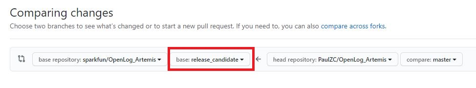

### How to Contribute

Thank you so *much* for offering to help out. We truly appreciate it.

If you'd like to contribute, start by searching through the [issues](https://github.com/sparkfun/OpenLog_Artemis/issues) and [pull requests](https://github.com/sparkfun/OpenLog_Artemis/pulls) to see whether someone else has raised a similar idea or question. Please check the [closed issues](https://github.com/sparkfun/OpenLog_Artemis/issues?q=is%3Aissue+is%3Aclosed)
and [closed pull requests](https://github.com/sparkfun/OpenLog_Artemis/pulls?q=is%3Apr+is%3Aclosed) too - you may find that your issue or feature has already been discussed.

If you decide to add a feature or support for a new sensor to OpenLog Artemis, please create a PR and follow these best practices:

* Change as little as possible. Do not sumbit a PR that changes 100 lines of whitespace. Break up into multiple PRs if necessary.
* If you add a new feature, please document how it works in the PR.
* Please submit your PR using the [release-candidate branch](https://github.com/sparkfun/OpenLog_Artemis/tree/release_candidate). That way, we can merge and test your PR quickly without changing the _master_ branch

## Style guide

Please read and follow the [Arduino API style guide](https://www.arduino.cc/en/Reference/APIStyleGuide). Also read and consider the [Arduino style guide](https://www.arduino.cc/en/Reference/StyleGuide).
